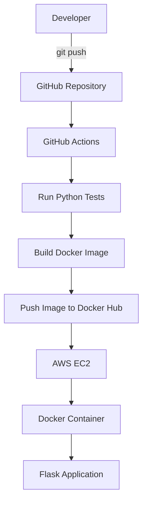

# 🚀 Python Flask CI/CD Pipeline


A portfolio-grade DevOps project demonstrating automated testing, Docker containerization, Docker Hub image publishing, and continuous deployment to an AWS EC2 server using GitHub Actions.

## 🏗️ Architecture


## 🛠️ Technologies Used

- Python
- Flask
- Pytest
- Docker
- Docker Hub
- GitHub
- GitHub Actions
- AWS EC2
- Ubuntu Linux
- SSH

## 🔄 CI/CD Pipeline

The workflow runs automatically for changes pushed to the `main` branch and also runs tests for pull requests.

### Continuous Integration

1. Checkout source code
2. Set up Python
3. Install dependencies
4. Run automated tests

### Continuous Deployment

For pushes to `main`:

5. Build Docker image
6. Push Docker image to Docker Hub
7. Connect to AWS EC2 through SSH
8. Pull the latest Docker image
9. Stop the previous container
10. Start the updated container

## 🧪 Testing

The application contains automated tests for:

- `/` endpoint
- `/health` endpoint

Example health response:

```json
{
  "status": "healthy"
}
🐳 Docker
Build the image locally:

docker build -t devops-cicd-pipeline .
Run the container:

docker run -d -p 5000:5000 --name devops-app devops-cicd-pipeline:latest
Application:

http://localhost:5000
Health check:

http://localhost:5000/health
☁️ AWS Deployment
The application is deployed on an AWS EC2 Ubuntu server.

The EC2 server runs the Flask application inside a Docker container.

Application port:

5000
🔐 GitHub Actions Secrets & Variables
The workflow uses GitHub repository secrets and variables for deployment credentials.

Secrets
DOCKERHUB_TOKEN
EC2_SSH_KEY
Variables
DOCKERHUB_USERNAME
EC2_HOST
EC2_USER
Sensitive credentials are not stored in the repository.

📁 Project Structure
devops-cicd-pipeline/
│
├── .github/
│   └── workflows/
│       └── ci.yml
│
├── app.py
├── test_app.py
├── requirements.txt
├── Dockerfile
├── .gitignore
└── README.md
🎯 DevOps Concepts Demonstrated
Git version control
CI/CD automation
Automated testing
Docker containerization
Docker image publishing
GitHub Actions
Linux administration
AWS EC2 deployment
SSH-based deployment
Environment variables and secrets
Automated deployment workflow
👨‍💻 Author
Aijaz Parvez

DevOps / Cloud Engineering Portfolio Project